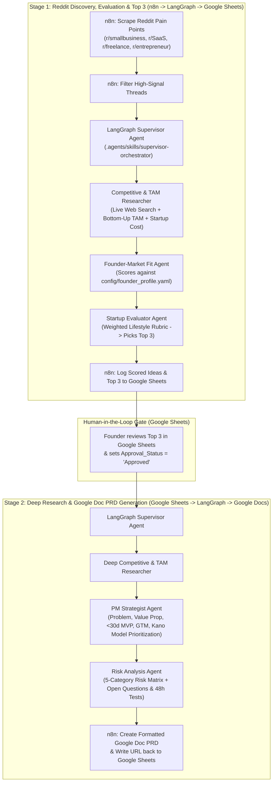

# Lifestyle Startup Discovery & Google Doc PRD Multi-Agent Pipeline

A **Hybrid n8n + LangGraph Multi-Agent System** built on the open **[Agent Skills (`agentskills.io`)](https://agentskills.io/home)** specification and inspired by **[n8n Workflow #6094](https://n8n.io/workflows/6094-generate-startup-ideas-from-reddit-posts-using-gemini-ai-and-google-sheets/)**.

---

## Architecture Overview

This project implements a **Two-Stage Human-in-the-Loop Pipeline** focused strictly on **Bootstrapped Lifestyle Businesses** (low startup cost `<$2,500`, `<30-day` MVP build, high gross margins, solo/small-team friendly):



---

## Standardized `agentskills.io` Modules (`.agents/skills/`)

Every specialized agent is packaged as a portable `SKILL.md` module under `.agents/skills/` so it can be loaded dynamically by the **Python LangGraph backend** ([`src/skill_loader.py`](src/skill_loader.py)) **and** discovered natively by any `agentskills.io`-compatible coding agent (Antigravity, Gemini CLI, Claude Code, Cursor):

| Agent Skill | Path | Responsibility |
| :--- | :--- | :--- |
| **Supervisor Orchestrator** | [`.agents/skills/supervisor-orchestrator/SKILL.md`](.agents/skills/supervisor-orchestrator/SKILL.md) | Orchestrates Stage 1 (Reddit → Top 3 in Google Sheets) and Stage 2 (Approved Sheet Row → Google Doc PRD). |
| **Competitive & Market Researcher** | [`.agents/skills/competitive-market-researcher/SKILL.md`](.agents/skills/competitive-market-researcher/SKILL.md) | Runs live web search for competitors, calculates **Bottom-Up TAM** ($\text{Target Users} \times \text{Annual Price}$), and estimates initial **Startup Cost**. |
| **Founder-Market Fit Agent** | [`.agents/skills/founder-market-fit/SKILL.md`](.agents/skills/founder-market-fit/SKILL.md) | Evaluates ideas against [`config/founder_profile.yaml`](config/founder_profile.yaml) (skills, budget ceiling, weekly hours, unfair advantages). |
| **Startup Evaluator Agent** | [`.agents/skills/startup-evaluator/SKILL.md`](.agents/skills/startup-evaluator/SKILL.md) | Scores ideas on the 5-part **Lifestyle Business Rubric** and selects the **Top 3**. |
| **PM Strategist Agent** | [`.agents/skills/pm-strategist/SKILL.md`](.agents/skills/pm-strategist/SKILL.md) | Writes Problem Statement, Value Proposition, `<30-Day` MVP Scope, GTM Strategy, and **Kano Model Feature Prioritization** mapped to Reddit pain points. |
| **Risk Analysis Agent** | [`.agents/skills/risk-analyst/SKILL.md`](.agents/skills/risk-analyst/SKILL.md) | Generates the 5-category Risk Matrix and **Open Questions** with `<48-hour` validation experiments. |

---

## Quickstart

### 1. Install Dependencies
```powershell
pip install -r requirements.txt
```

### 2. Configure Environment & Founder Profile
1. Copy `.env.example` to `.env` and set your `GEMINI_API_KEY`:
   ```powershell
   Copy-Item .env.example .env
   ```
2. Customize [`config/founder_profile.yaml`](config/founder_profile.yaml) with your specific founder or team profile (e.g., Jev, Rita, VJ), technical skills, max startup cost budget, and weekly hours.

### 3. Run the End-to-End Pipeline via CLI
Run both Stage 1 and Stage 2 locally to generate a Google Sheets CSV preview (`outputs/google_sheets_evaluated_ideas.csv`) and a full Google Doc PRD (`outputs/google_doc_prd_top1.md`):
```powershell
python cli.py
```

### 4. Start the FastAPI Server for n8n
```powershell
python -m src.main
```
- Interactive Swagger UI: `http://localhost:8000/docs`
- Stage 1 Webhook: `POST http://localhost:8000/api/v1/stage1/evaluate`
- Stage 2 Webhook: `POST http://localhost:8000/api/v1/stage2/generate-prd`

### 5. Import the n8n Workflows
1. Open your n8n instance and import:
   - [`n8n/stage1_reddit_to_sheets_evaluator.json`](n8n/stage1_reddit_to_sheets_evaluator.json)
   - [`n8n/stage2_sheets_human_approval_to_gdoc_prd.json`](n8n/stage2_sheets_human_approval_to_gdoc_prd.json)
2. Connect your **Reddit**, **Google Sheets**, and **Google Docs** credentials in n8n and replace `YOUR_GOOGLE_SHEET_ID_HERE` with your spreadsheet ID.
